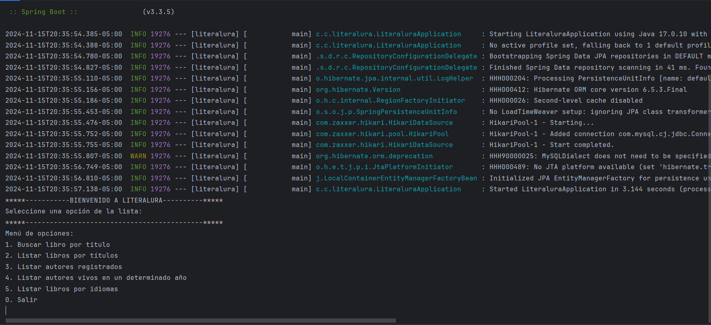
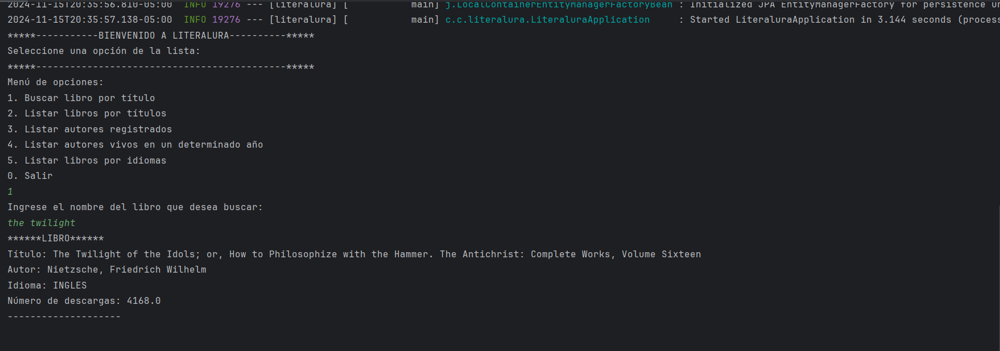
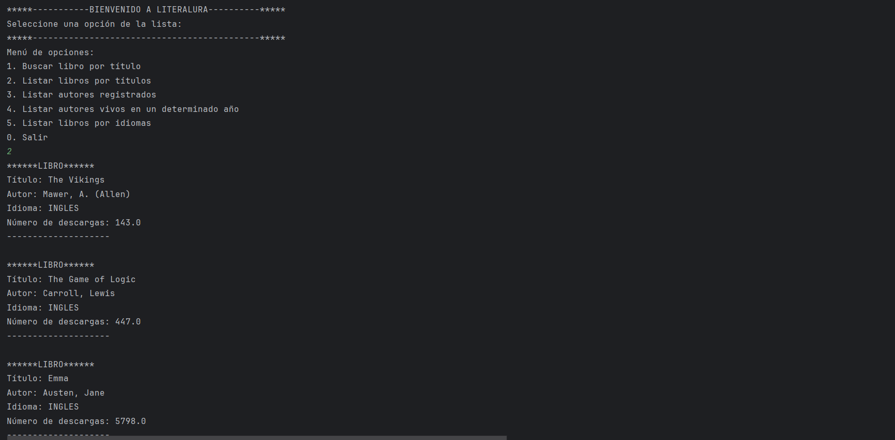
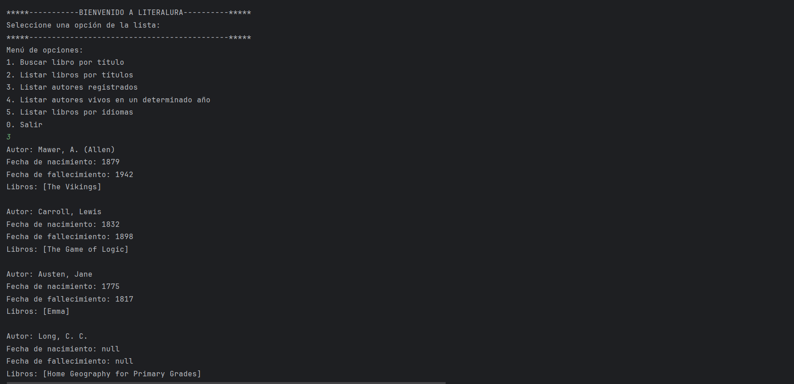
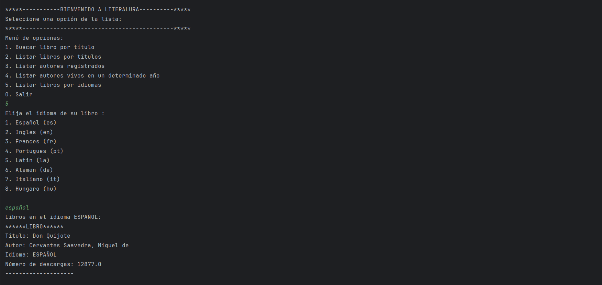
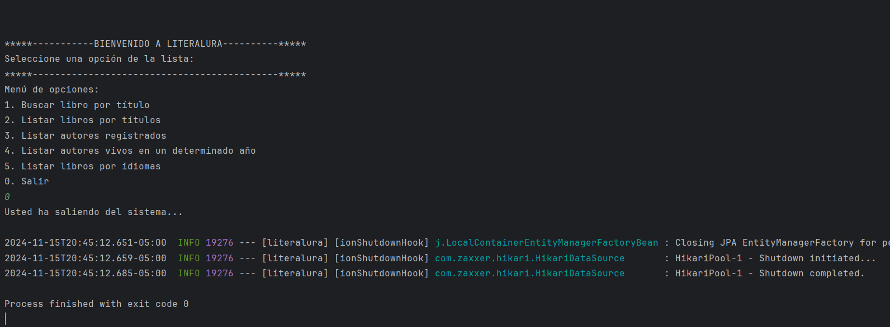

# Challenge LiterAlura💻

Este programa es un desafio que forma parte del programa d educacion en tecnologia de ORACLE ONE + ALURA LATAM, el cual se centra en el consumo de una Api que contiene una biblioteca de libros, en donde el usuario podra eligir entre diferentes opciones que se detallan mas adelante. Te invito a explorar mas sobre este programa, vamos..!

## Comencemos 🚀

_Estas instrucciones te permitirán obtener una copia del proyecto en funcionamiento en tu máquina local para propósitos de desarrollo y pruebas._

### Pre-Requisitos 📋

_Para ejecutar este proyecto, necesitarás tener instalado lo siguiente:_

- JDK 17 o superior
- Maven (para gestionar las dependencias)
- Spring: versión actual
- Mysql: versión actual
- IDE (Entorno de desenvolvimento integrado) - IntelliJ IDEA

Para el **Despliegue** se detalla los siguientes pasos.
#### Instalación en Windows

1. **Instalar Java**
    - Descarga e instala el JDK desde el sitio oficial de Oracle:  
      [Descargar JDK](https://www.oracle.com/java/technologies/javase-jdk21-downloads.html)
    - Sigue las instrucciones del instalador para instalar el JDK.
    - Verifica la instalación abriendo la consola `cmd` y ejecutando:
      ```
      java -version
      ```

2. **Instalar Maven**
    - Descarga Maven desde el sitio oficial:  
      [Descargar Maven](https://maven.apache.org/download.cgi)
    - Descomprime el archivo descargado y agrega la ruta de Maven a las variables de entorno de tu sistema.
    - Verifica la instalación abriendo la consola `cmd` y ejecutando:
      ```
      mvn -version
      ```

### Instalación 🔧

_Una serie de pasos para tener el entorno de desarrollo configurado:_

1. **Clonar el repositorio**  
   Clona este repositorio en tu máquina local usando Git:
   ```
   git clone https://github.com/ariocal/Literalura.git
   cd literalura
   ```

2. **Agregar dependencias**  
   Este proyecto utiliza Jackson y JPA. Si estás usando Maven, puedes agregar las dependencias al archivo `pom.xml` de la siguiente manera:

   ```xml
   <dependencies>
      <dependency>
			<groupId>com.fasterxml.jackson.core</groupId>
			<artifactId>jackson-databind</artifactId>
			<version>2.18.0</version>
		</dependency>
   <dependency>
			<groupId>org.springframework.boot</groupId>
			<artifactId>spring-boot-starter-data-jpa</artifactId>
		</dependency>
   </dependencies>
   ```

3. **Compilar el proyecto**  
   Compila el proyecto con Maven:
   ```
   mvn clean install
   ```

_Finaliza estos pasos con la creación del archivo JAR ejecutable:_

4. **Crear el archivo JAR**  
   Ejecuta el siguiente comando para empaquetar el proyecto en un archivo JAR:
   ```
   mvn package
   ```

5. **Ejecutar el programa**  
   Para ejecutar el archivo JAR generado, utiliza:
   ```
   java -jar target/literalura.jar
   ```

### Guia de funcionamiento ⌨️
-Al ejecutar la aplicación se los desplegara una pantalla de opciones de las cuales podremos elegir una...
###### Pantalla principal.


En la opcion 1 podremos buscar un libro en donde se nos presentara datos relacionados a el mismo, el cual tambien se guardara en el base de datos que estemos usando.
###### uscar libro por título.
 
 
En la opcion 2 tenemos la oportunidad de desplegar un listado de todos los libros que hemos buscado
###### Listar libros por títulos


Sin duda cada uno de esos libros fue escrito por un autor, por lo que en esta opcion podras visualizar cuales son esos autores que escribrieron los libros que buscastes
###### Listar autores registrados.


Podras tambien tener la opcion de especificar un año y saber que autores todavia estaban viven en ese año
###### Listar autores vivos en un determinado año.


Por ultimo podras buscar libros segun tu idioma preferido
###### Listar libros por idiomas.


Para salir del sisteam eligimos la opcion 0
###### Listar libros por idiomas.


## Construido con 🛠️

_Herramientas utilizadas en el desarrollo del proyecto:_

* [Java](https://www.oracle.com/java/) - El lenguaje de programación principal
* [Maven](https://maven.apache.org/) - Manejador de dependencias
* [Jackson](https://mvnrepository.com/artifact/com.fasterxml.jackson.core/jackson-core)) - Mapeo eficiente de los datos JSON 
* [MySql](https://www.mysql.com/downloads/) - Base de Datos
* [Gutendex-API][(https://gutendex.com/) - API para acceder a libros

## Autor ✒️


* **Mario Calderon** - *Creador* - 👨🏽‍💻🖥️
